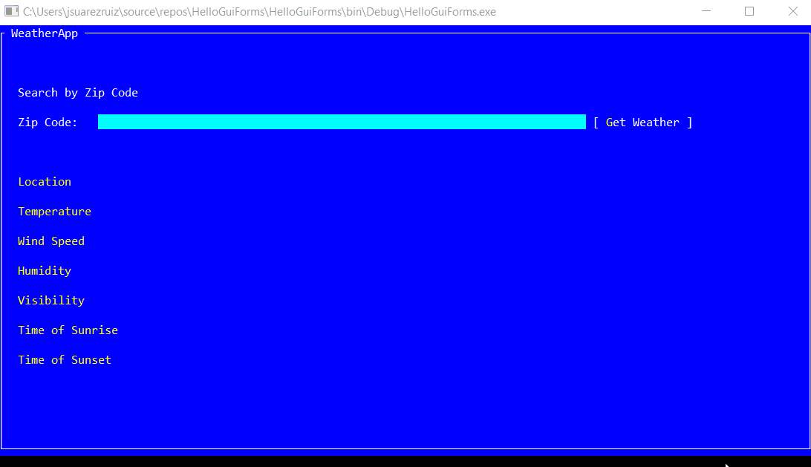

# Weather

**Weather** is a Xamarin.Forms **gui.cs backend** application that makes use [OpenWeatherMap.org API](https://openweathermap.org/api), to demonstrate the possibilities of the new backend.

## Xamarin.Forms App 

[Xamarin.Forms](https://www.xamarin.com/forms) allows you to build native UIs for iOS, Android, **Windows**, macOS and Linux from a single, shared codebase. You can dive into mobile development with Xamarin.Forms by following our [free self-guided learning](https://university.xamarin.com/classes/track/self-guided) from Xamarin University. This project exercises the following patterns and features:

* Xamarin.Forms
  * [XAML UI](https://developer.xamarin.com/guides/xamarin-forms/xaml/xaml-basics/)
  * Converters
  * Custom Controls
  * [Data Binding](https://developer.xamarin.com/guides/xamarin-forms/xaml/xaml-basics/data_binding_basics/)
  * [MVVM](https://developer.xamarin.com/guides/xamarin-forms/xaml/xaml-basics/data_bindings_to_mvvm/)
  * [Styles](https://developer.xamarin.com/guides/xamarin-forms/user-interface/styles/)

## Licenses

This project is based on [MyWeather.Forms](https://github.com/jamesmontemagno/MyWeather.Forms) by James Montemagno.
 
## Clean and Rebuild

If you see build issues when pulling updates from the repo, try cleaning and rebuilding the solution.

## Copyright and license

Code released under the [MIT license](https://opensource.org/licenses/MIT).
